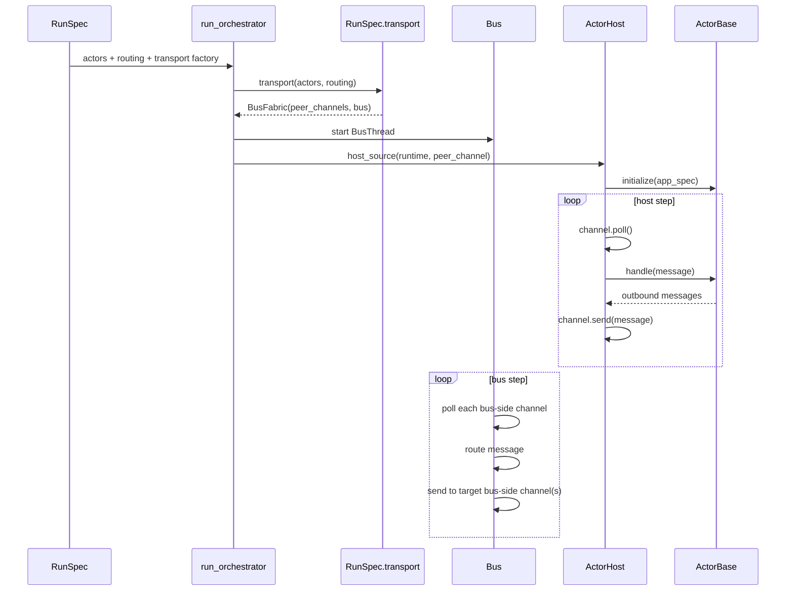
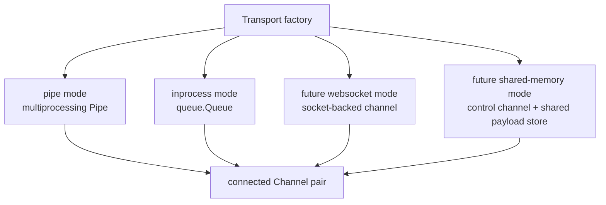
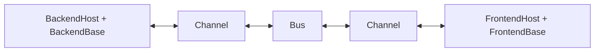
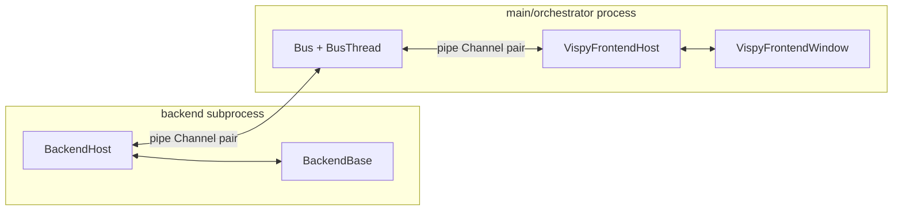
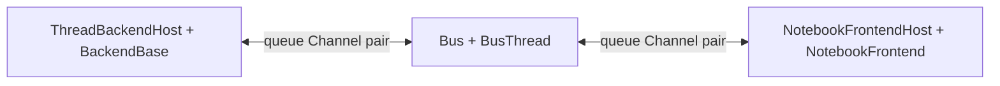
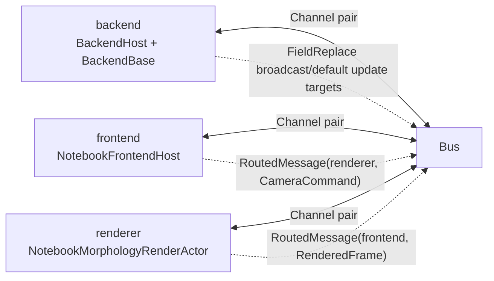
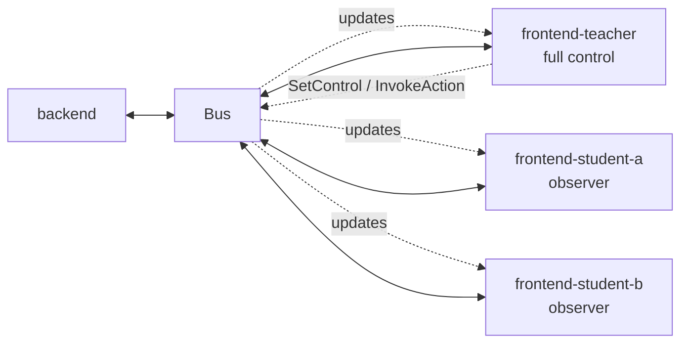
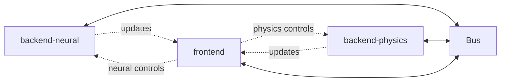
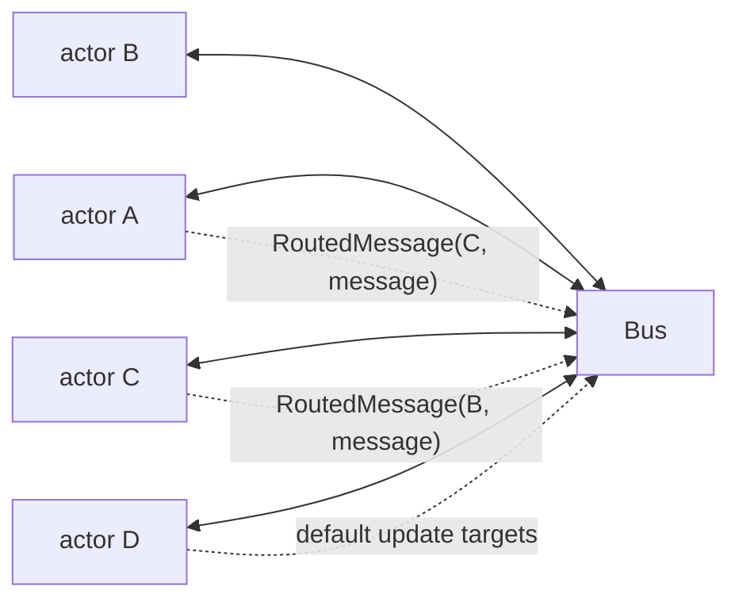

# Host, Channel, Bus, and Transport

This document records the current runtime boundary after the actor/bus refactor.
The key split is:

- `ActorBase` is user/runtime behavior.
- `ActorHost` drives an actor lifecycle and pumps messages.
- `Channel` is the minimal message interface consumed by hosts and the Bus.
- `Transport` is the mechanism that creates connected channels.
- `Bus` is framework routing infrastructure between peer actors in one app run.
- `RunSpec.routing` is the single declared routing policy.

## Scope: One Bus Per App Run

The intended model is **one Bus per orchestrated app run**, not one process-wide
or package-wide singleton.

```text
RunSpec / AppRuntime instance
  owns exactly one routing fabric:
    Bus
      + one bus-side Channel per declared actor id
      + one peer Channel handed to each actor host
```

That means:

- A normal `run_app(spec)` has one Bus.
- A notebook-launched app has one Bus.
- A pure `run_orchestrator(spec)` remote session has one Bus.
- Two independent app runs have two independent Buses.
- A future federation or bridge may connect app runs, but that is composition
  above this model, not hidden extra routing inside transports or hosts.

The Bus is singular inside a run because it is the routing authority for that
run's declared actor topology. This avoids splitting policy across transports,
relay actors, host subclasses, and ad hoc frontend branches.

## Core Shape

```mermaid
flowchart LR
    subgraph P1["Peer actor process/thread A"]
        AActor["ActorBase<br/>BackendBase / FrontendBase"]
        AHost["ActorHost<br/>BackendHost / FrontendHost / Qt host / notebook host"]
        AActor <-- "initialize / handle / emit / take_outbound" --> AHost
    end

    subgraph T1["Transport-created channel pair"]
        APeer["peer Channel<br/>send / poll / close"]
        ABus["bus-side Channel<br/>send / poll / close"]
        APeer <-- "pipe, queue, websocket, etc." --> ABus
    end

    Bus["Bus<br/>route by RoutedMessage,<br/>RunSpec.routing,<br/>then default broadcast"]

    subgraph T2["Transport-created channel pair"]
        BBus["bus-side Channel<br/>send / poll / close"]
        BPeer["peer Channel<br/>send / poll / close"]
        BBus <-- "pipe, queue, websocket, etc." --> BPeer
    end

    subgraph P2["Peer actor process/thread B"]
        BHost["ActorHost<br/>BackendHost / FrontendHost / Qt host / notebook host"]
        BActor["ActorBase<br/>BackendBase / FrontendBase"]
        BHost <-- "initialize / handle / emit / take_outbound" --> BActor
    end

    AHost <-- "poll/send" --> APeer
    ABus <-- "poll/send" --> Bus
    Bus <-- "poll/send" --> BBus
    BPeer <-- "poll/send" --> BHost
```



There is no separate "Bus peer" object. The peers are the declared actors in
`RunSpec.actors`. The Bus owns one bus-side channel per actor id.

## Responsibilities

| Piece | Owns | Does not own |
|---|---|---|
| `ActorBase` | Actor behavior: `initialize`, `handle`, `emit`, `shutdown` | Transport, routing, process lifecycle |
| `ActorHost` | Lifecycle and pump loop: channel to actor, actor outbox to channel | Bus, routing policy, pipe/queue/websocket details |
| `Channel` | Minimal message API: `send`, `poll`, `close` | Routing policy, actor lifecycle |
| `Transport` | Creates connected channels using a mechanism | Message meaning, actor roles, routing |
| `Bus` | Routing between bus-side channels | Actor lifecycle, simulation/render state, transport mechanics |
| `RunSpec.routing` | Declared topology routing policy | Channel construction, message pumping |

The host needs a `Channel`, not a transport. The Bus also needs channels, not a
transport. Transport is the factory layer that produced those channels.

## Startup Wiring



`RunSpec.routing` is passed into the transport factory by `run_orchestrator`.
`bus_transport(mode=...)` uses that routing when constructing the Bus. This
keeps routing out of transport call sites and removes the previous duplication
where routing could be passed both to the transport factory and to `RunSpec`.

## Routing Rules

The Bus routes in this order:

1. `RoutedMessage`: explicit target actor id wins. The Bus unwraps it and sends
   the inner message to the target.
2. Ordered routes from `RunSpec.routing`: match by intent, message type, and
   optional payload attributes.
3. Default command/update targets from `RunSpec.routing`.
4. Empty-routing fallback: broadcast to every other actor.

Direction is based on message intent, not actor role. A backend may emit a
command and a frontend may emit an update; the Bus does not infer direction
from `ActorRole`.

## Transport Examples

All transports expose the same channel shape to hosts and the Bus.



The rest of the runtime does not care which mechanism created the channel pair.

## Topology Examples

### T1: Local Single Process

Backend, frontend, Bus, and orchestrator all live in one process. The transport
creates in-process channel pairs.



Why this is easy: only the transport mode changes. Hosts still receive channels;
the Bus still applies `RunSpec.routing`.

### T2: Local Multiprocess Desktop

The backend runs in a subprocess, the Qt frontend runs in the main process, and
the Bus runs in the orchestrator process.



Why this is easy: the backend host and frontend host still see only channels.
Process boundaries are transport mechanics.

### T3: Notebook Thread

The backend runs in a daemon thread, the notebook frontend runs in the kernel
event loop, and channels are in-process queues.



Why this is easy: notebook async polling is a host policy. It does not change
actor or routing abstractions.

### T3 Variant: Notebook With Render Actor

The notebook widget frontend and morphology renderer are separate frontend-role
actors. Backend updates can fan out to both; camera commands can target only
the renderer; rendered frames route back to the notebook actor.



Why this is easy: the renderer is just another actor in `RunSpec.actors`.
Frontend-to-frontend traffic is normal routed messaging.

### T5: Broadcast 1 Backend to N Frontends

One backend emits updates to multiple frontend actors. Some frontends may be
observers with no command routes back to the backend.



`RunSpec.routing` declares generic route rules:

```python
RoutingSpec(
    routes=(
        RouteSpec(
            match=MessageMatch(
                intent="command",
                message_type="set_control",
                attrs={"control_id": "stim_amp"},
            ),
            targets=("backend",),
        ),
        RouteSpec(
            match=MessageMatch(
                intent="command",
                message_type="invoke_action",
                attrs={"action_id": "reset"},
            ),
            targets=("backend",),
        ),
    ),
    default_targets={
        "command": ("backend",),
        "update": ("frontend-teacher", "frontend-student-a", "frontend-student-b"),
    },
)
```

Why this is easy: fan-out is a Bus behavior, not a different transport type.
The transport still only creates one channel pair per actor.

### T6: Multiple Backends Feeding One Frontend

Several backend actors emit updates into one frontend. Commands can route to
specific backends by interaction id.



`RunSpec.routing` can declare:

```python
RoutingSpec(
    routes=(
        RouteSpec(
            match=MessageMatch(message_type="set_control", attrs={"control_id": "stim_amp"}),
            targets=("backend-neural",),
        ),
        RouteSpec(
            match=MessageMatch(message_type="set_control", attrs={"control_id": "muscle_gain"}),
            targets=("backend-physics",),
        ),
        RouteSpec(
            match=MessageMatch(message_type="invoke_action", attrs={"action_id": "reset_neural"}),
            targets=("backend-neural",),
        ),
        RouteSpec(
            match=MessageMatch(message_type="invoke_action", attrs={"action_id": "reset_physics"}),
            targets=("backend-physics",),
        ),
    ),
    default_targets={"update": ("frontend",)},
)
```

Why this is easy: adding a backend means adding an `ActorSpec` and routing
entries. No host, actor, or transport abstraction changes.

### T7: Mesh

Any actor can address any other actor explicitly with `RoutedMessage`. The Bus
does not need a new role or relay hierarchy.



Why this is easy: explicit addressing is carried by the message envelope, while
default behavior remains declarative in `RunSpec.routing`.

## Design Consequences

This model keeps the abstractions singular within an app run:

- There is one actor abstraction: `ActorBase`.
- There is one host pump abstraction: `ActorHost`, with role/event-loop
  specializations where needed.
- There is one host-facing communication abstraction: `Channel`.
- There is one framework router per run: `Bus`.
- There is one topology policy source: `RunSpec.routing`.
- Transport remains pure mechanism.

Stage 2 structural authority, if added later, should be layered on this model as
another actor/service using channels through the Bus. It should not make the Bus
own app structure and should not make hosts aware of routing or transports.
